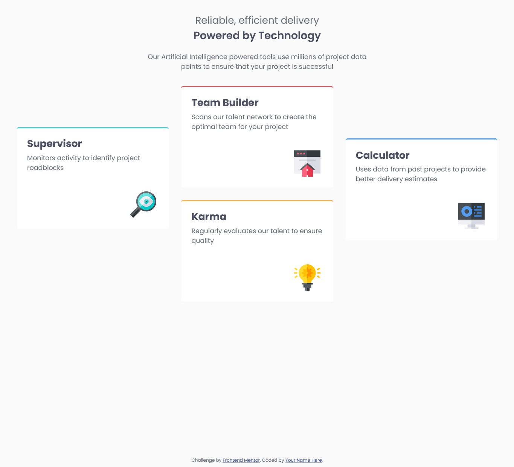
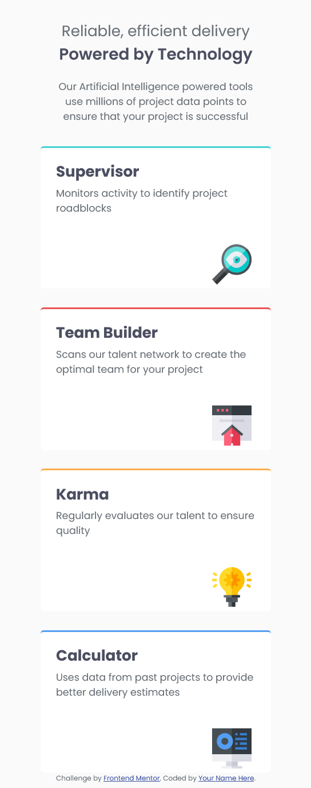

# Frontend Mentor - Four card feature section solution

This is my solution to the [Four card feature section challenge on Frontend Mentor](https://www.frontendmentor.io/challenges/four-card-feature-section-weK1eFYK). Frontend Mentor challenges help me improve my coding skills by building realistic projects.

## Table of contents

* [Overview](#overview)

  * [The challenge](#the-challenge)
  * [Screenshot](#screenshot)
  * [Links](#links)
* [My process](#my-process)

  * [Built with](#built-with)
  * [What I learned](#what-i-learned)
  * [Continued development](#continued-development)
  * [Useful resources](#useful-resources)
  * [AI Collaboration](#ai-collaboration)
* [Author](#author)
* [Acknowledgments](#acknowledgments)

## Overview

### The challenge

The challenge was to build a responsive four-card feature section based on the design provided by Frontend Mentor.

Users should be able to:

* View the optimal layout for the site depending on their device's screen size.
* See the four feature cards displayed appropriately on both mobile and larger screen sizes.

### Screenshot

Add a screenshot of your completed project here.

```md


```

### Links

* Solution URL: **Add your Frontend Mentor solution URL here**
* Live Site URL: **Add your live site URL here**

## My process

I started the project by building the HTML structure first. After setting up the basic HTML, I began styling the page and naming the different elements and containers so that I could work with them easily in CSS.

I followed a mobile-first approach, so I started by creating the mobile layout before moving on to the desktop version.

My development process was roughly:

1. Set up the HTML structure.
2. Begin the initial styling.
3. Create and name the different sections and `div` elements.
4. Create and style the four feature cards.
5. Add the SVG icons to the cards.
6. Position the icons and adjust the spacing and text.
7. Work on the text colours and overall appearance.
8. Create the desktop layout using CSS Grid.
9. Use media queries to change the layout for larger screens.
10. Make final adjustments to the spacing and positioning.

I spent approximately five hours working on this project. Although I still consider myself relatively slow when building projects, I can already see an improvement compared with my previous card project, which took almost an entire day. I expect my development speed to improve naturally as I continue practicing and building more projects.

### Built with

* Semantic HTML5 markup
* CSS custom properties
* Flexbox
* CSS Grid
* Mobile-first workflow
* Media queries

### What I learned

This project helped me understand CSS Grid much better. Before working on this project, I understood the basic idea of Grid, but actually using it to position the four cards gave me a much better understanding of how rows, columns, gaps, and positioning work together.

I also gained a much better understanding of media queries and how they can be used to change a layout depending on the screen size. Working on the mobile layout first and then creating the desktop layout helped me understand responsive design more clearly.

Flexbox also came in very handy for controlling the overall alignment and positioning of the page, while CSS Grid was particularly useful for creating the desktop card layout.

Another thing I learned during the project was how to properly work with Google Fonts. The font provided in the original documentation was not working as expected, so I went back to Google Fonts, obtained the correct embed code, and added it to my HTML. This allowed me to use the Poppins font correctly.

### Continued development

There are still several areas I want to improve as I continue building projects.

I want to become more comfortable with CSS Grid so that I can create complex layouts without relying heavily on trial and error. I also want to continue practicing Flexbox and responsive design.

I would like to improve my understanding of positioning, spacing, and sizing so that I can create layouts that are more consistent across different screen sizes.

I also want to improve my ability to structure my HTML and CSS cleanly and efficiently, while continuing to practice mobile-first development.

As I complete more Frontend Mentor challenges, I hope to become faster at translating a design into a working webpage and reduce the amount of time I need to spend figuring out individual layout problems.

### Useful resources

* [Frontend Mentor](https://www.frontendmentor.io/) - This challenge provided the design and requirements for the project.
* [MDN Web Docs](https://developer.mozilla.org/) - Useful for understanding HTML and CSS concepts and checking CSS properties.
* [CSS-Tricks](https://css-tricks.com/) - Useful for learning and understanding CSS layout techniques, particularly Flexbox and Grid.
* [Google Fonts](https://fonts.google.com/) - Used to obtain and embed the Poppins font used in the project.

### AI Collaboration

I used AI during this project mainly to help me understand concepts I was not completely comfortable with and to help me create and structure this README.

AI was also useful when I needed clarification about CSS concepts and how certain properties worked.

One example was working with the Poppins font. The font implementation provided in the original documentation was not working for me, so I went back to Google Fonts, obtained the correct embed code, and added it to my HTML.

I used AI as a learning and troubleshooting aid rather than having it build the project for me. The HTML and CSS were written and developed by me while I used AI to help explain concepts and resolve areas where I needed additional understanding.

## Author

* Website - **Add your website here**
* Frontend Mentor - **Add your Frontend Mentor profile here**
* GitHub - **Add your GitHub profile here**

## Acknowledgments

Thanks to Frontend Mentor for providing the challenge and design that I used to practice my HTML and CSS skills.
